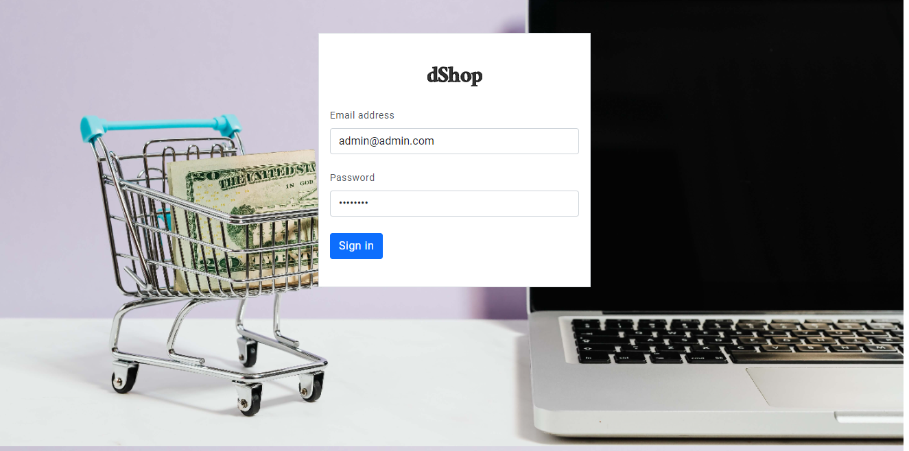
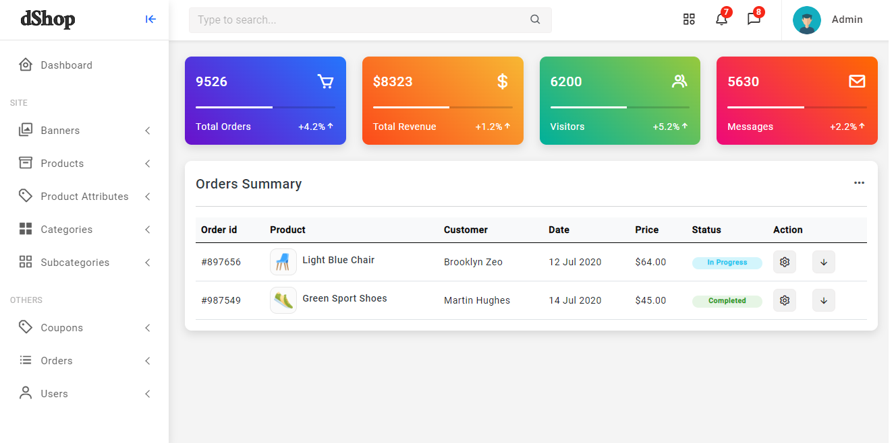
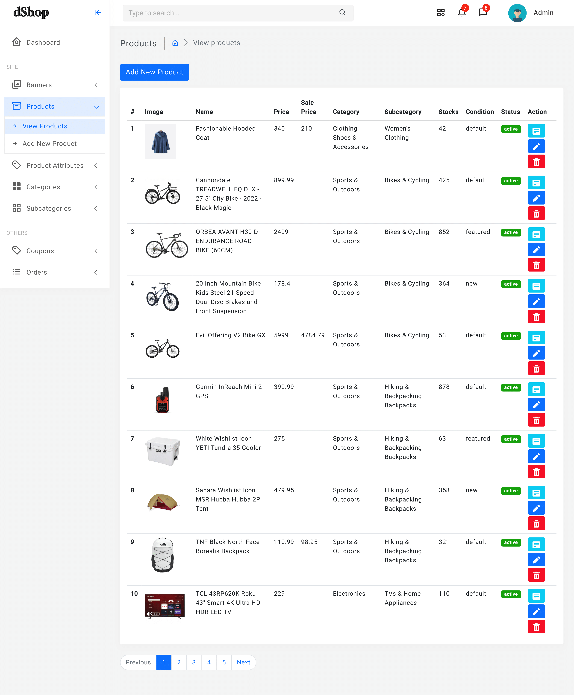

<h1 align="center" >
    
</h1>

<p align="center">
a fullstack Ecommerce website built with NEXTJS and Laravel
</p>

## Table of contents

-   [Features](#features)
-   [Technologies](#technologies)
-   [Running Locally](#running-locally)
-   [Screenshots](#screenshots)

## Features

For Client:

-   Responsive design
-   Sign in, Sign up and Oauth2 (Google and Facebook)
-   Forgot and reset password functionality
-   Account address, details and settings
-   CRUD functionality for shopping cart
-   CRUD functionality for wishlist
-   Coupons & Discounts
-   Currency options
-   Product search, Product quickview, Product details, reviews and related products
-   Checkout and orders
-   And more...

For Admin:

-   Admin Settings
-   Manage Products
-   Manage Product attributes (size, colors...)
-   Manage Banners
-   Manage Categories and Subcategories
-   Manage Coupons and discounts
-   Manage Orders
-   Manage Users
-   And more...

## Technologies

this project is built with:

-   Laravel
-   Laravel Socialite
-   Laravel Passport
-   ...

## Running Locally

<b>Note</b>: make sure to check the `client` branch as well

1 - clone this repo and install the dependencies:
`composer install`

2 - rename `.env.example` to `.env`

3 - run the command: `php artisan key:generate`

4 - Import database from `database/ecommerce.sql`

5 - Configure `.env` with DB, Google and Facebook Oauth2 credentials (for Oauth sign-in and sign-up) and mail service provider (for password resets):

```env
DB_CONNECTION=mysql
DB_HOST=127.0.0.1
DB_PORT=3306
DB_DATABASE=ecommerce
DB_USERNAME=root
DB_PASSWORD=

CLIENT_WEBSITE=http://localhost:3000

GOOGLE_CLIENT_ID=
GOOGLE_CLIENT_SECRET=

FACEBOOK_CLIENT_ID=
FACEBOOK_CLIENT_SECRET=

MAIL_MAILER=smtp
MAIL_HOST=
MAIL_PORT=587
MAIL_USERNAME=
MAIL_PASSWORD=
MAIL_ENCRYPTION=tls
MAIL_FROM_NAME="${APP_NAME}"
```

6 - Finally run the command: `php artisan serve`

7 - Admin credentials:
email: admin@admin.com
password: password

## Screenshots

(see the `client` branch for the client website screenshots)

Login


Dashboard


Products

