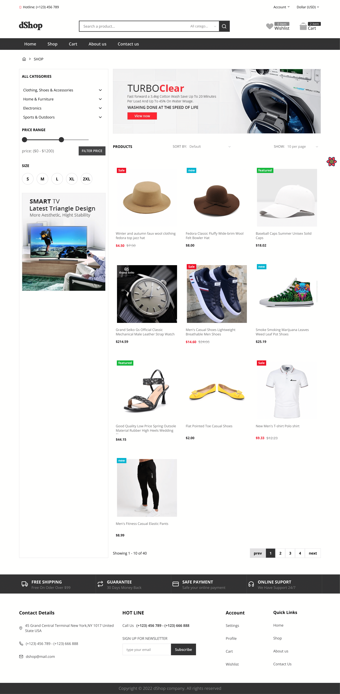
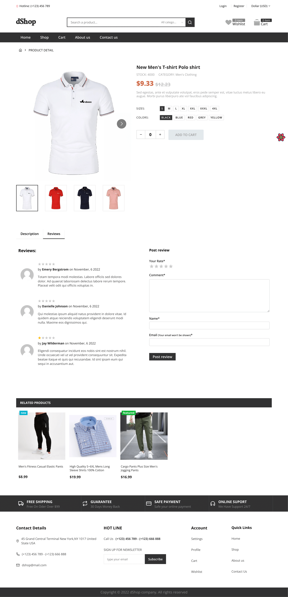
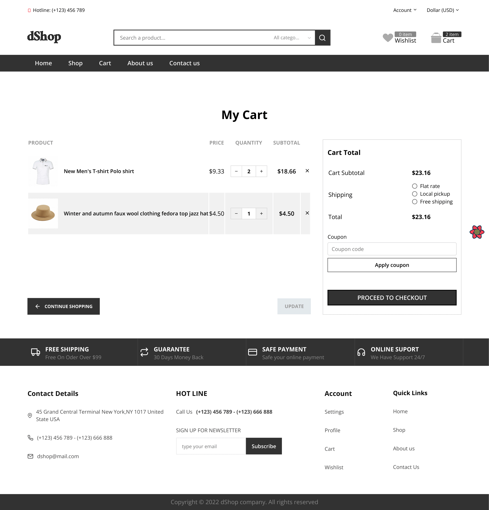

<h1 align="center" >
    
</h1>

<p align="center">
a fullstack Ecommerce website built with NEXTJS and Laravel
</p>

## Table of contents

- [Demo](#demo)
- [Features](#features)
- [Technologies](#technologies)
- [Running Locally](#running-locally)
- [Screenshots](#screenshots)

## Demo
[CLICK HERE](https://dshop-laravel-kyoub.vercel.app)
## Features

For Client:

- Responsive design
- Sign in, Sign up and Oauth2 (Google and Facebook)
- Forgot and reset password functionality
- Account address, details and settings
- CRUD functionality for shopping cart
- CRUD functionality for wishlist
- Coupons & Discounts
- Currency options
- Product search, Product quickview, Product details, reviews and related products
- Checkout and orders
- And more...

For Admin:

- Admin Settings
- Manage Products
- Manage Product attributes (size, colors...)
- Manage Banners
- Manage Categories and Subcategories
- Manage Coupons and discounts
- Manage Orders
- Manage Users
- And more...

## Technologies

this project is built with:

- Nextjs
- React Query
- Zustand
- Radix UI
- Stitches js
- React Hook Form
- ...

## Running Locally

<b>Note</b>: make sure to check the `server` branch as well

1 - clone this repo and install the dependencies:
`npm install`

2 - Create a `.env.local` file in the root directory and add:

```env
NEXT_PUBLIC_API_URL=http://localhost:8000
```

3 - Finally run the command: `npm run dev`

## Screenshots

(see the `server` branch for the admin dashboard screenshots)

Home:


Shop:


Product:


User Cart:

